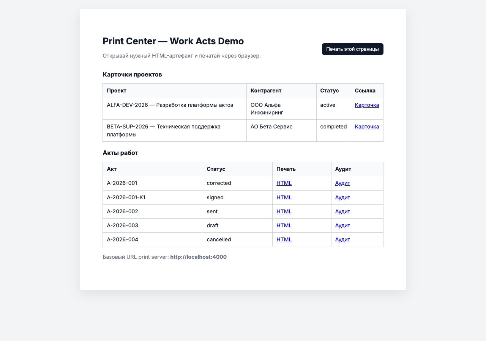
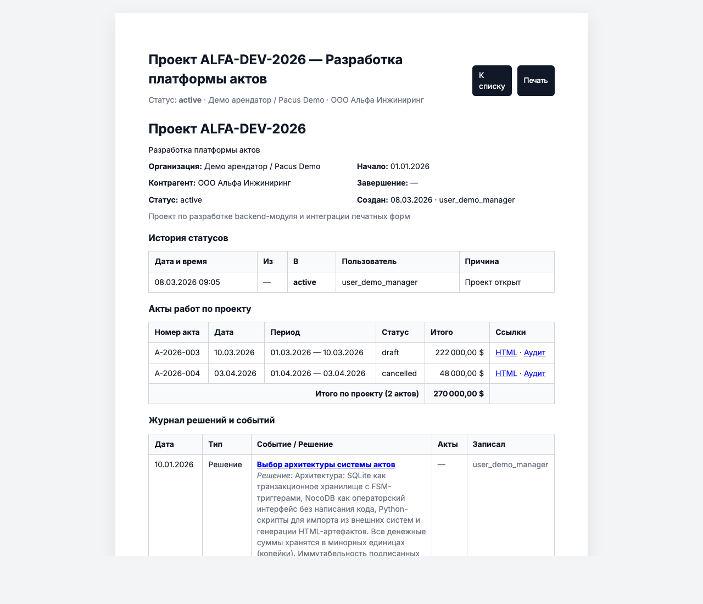
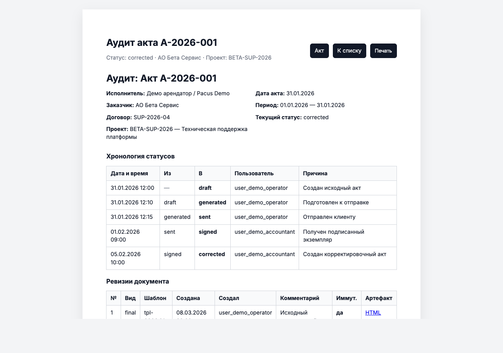
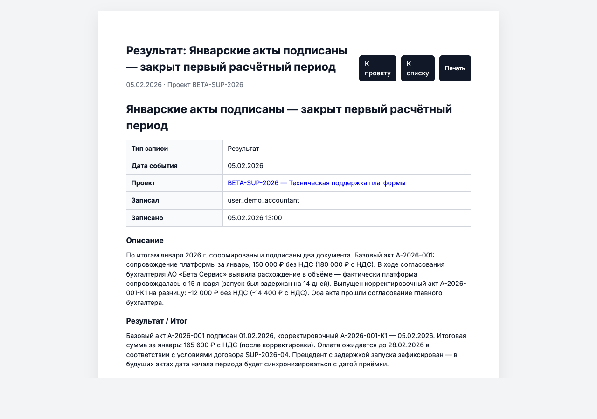

# Pacus — Work Acts Management System

**Pacus** is a lightweight work-acts (акты выполненных работ) management system built on SQLite + NocoDB. It manages the full lifecycle of work acts and projects: from draft through signing and corrections, with immutable revision ledgers, FSM-controlled status transitions, and printable HTML artifacts auto-generated from the database.

---

## Screenshots

| Dashboard | Project card |
|-----------|-------------|
|  |  |

| Act audit trail | Journal entry |
|-----------------|---------------|
|  |  |

---

## Architecture

```
SQLite (WAL)          NocoDB              Python scripts         Browser
─────────────         ───────             ──────────────         ───────
work_acts_schema  →   operator GUI    gen_artifacts.py  →   static HTML
projects_schema   →   views / forms   import_inbox.py   →   print-ready PDFs
project_journal   →   audit trail     run_inbox.sh
```

**Stack:**
- **SQLite** — transactional storage, FSM triggers, immutable revision ledger
- **NocoDB** — zero-code operator UI over SQLite
- **Python 3** — artifact generator + inbox importer
- **Static HTML** — self-contained printable artifacts (inline CSS, relative links, file:// compatible)

---

## Project Structure

```
pacus/
├── db/sqlite/
│   ├── work_acts_schema.sql          # Core domain: work acts, revisions, counterparties
│   ├── work_acts_seed_demo.sql       # Demo data: 5 acts in various states
│   ├── projects_schema.sql           # Projects domain: FSM, history, links to acts
│   ├── projects_seed_demo.sql        # Demo data: 2 projects
│   ├── project_journal_schema.sql    # Decision log: journal entries + act junction
│   └── project_journal_seed_demo.sql # Demo data: 8 rich journal entries
│
├── scripts/
│   ├── gen_artifacts.py              # Generate all HTML from DB
│   ├── import_inbox_work_acts.py     # Process integration inbox
│   ├── run_inbox_import.sh
│   ├── start_work_acts_demo.sh       # Start NocoDB + print server
│   └── stop_work_acts_demo.sh
│
├── tests/
│   ├── test_db_schema.py             # 88 schema/constraint/trigger tests
│   └── test_mutations.py             # 22 mutation tests (prove guards are load-bearing)
│
├── data/
│   ├── sqlite/work_acts_demo.sqlite  # Main database
│   └── artifacts/                    # Generated HTML (git-tracked)
│       ├── index.html                # Dashboard: all projects + acts
│       ├── projects/tenant_demo/
│       │   ├── proj_alfa_dev/
│       │   │   ├── project-card.html
│       │   │   └── journal/          # One HTML per journal entry
│       │   └── proj_beta_support/
│       │       ├── project-card.html
│       │       └── journal/
│       └── acts/tenant_demo/2026/
│           └── {act_id}/
│               ├── rev-1/act.html    # Print-ready act document
│               └── audit/audit.html  # Audit trail
│
├── docs/                             # Technical specs (HTML)
│   ├── work-acts-index.html
│   ├── work-acts-db-schema.html
│   ├── work-acts-architecture.html
│   └── projects-spec.html
│
├── .agents/                          # AI agent guidance
│   ├── SKILLS.md
│   └── skills/
│       ├── projects.md
│       ├── work_acts.md
│       └── db_invariants.md
│
└── CHANGELOG.md
```

---

## Domain Model

### Work Acts (акты работ)

| Status | Transitions |
|--------|-------------|
| `draft` | → `generated` |
| `generated` | → `sent`, `draft` |
| `sent` | → `signed`, `generated` |
| `signed` | → `corrected` |
| `corrected` | — (terminal) |
| `cancelled` | — (terminal) |

Each act has **immutable revisions** — once a revision is marked `final`, it cannot be changed. Corrections produce a new act linked to the original via `correction_of`.

### Projects

| Status | Transitions |
|--------|-------------|
| `active` | → `on_hold`, `completed`, `cancelled` |
| `on_hold` | → `active`, `cancelled` |
| `completed` | — (terminal) |
| `cancelled` | — (terminal) |

Projects aggregate acts from the same tenant + counterparty pair. Cross-entity consistency (tenant match, counterparty match) is enforced by DB triggers — the application cannot bypass these invariants.

### Project Journal

An append-only decision log per project. Each entry records:
- **type**: `decision` | `result` | `milestone`
- **title** + full **body** (context, participants, alternatives)
- **decision_made** or **outcome** summary
- Linked work acts (via junction table)

---

## Quick Start

### 1. Build the database

```bash
# Start fresh
rm -f data/sqlite/work_acts_demo.sqlite

sqlite3 data/sqlite/work_acts_demo.sqlite < db/sqlite/work_acts_schema.sql
sqlite3 data/sqlite/work_acts_demo.sqlite < db/sqlite/work_acts_seed_demo.sql
sqlite3 data/sqlite/work_acts_demo.sqlite < db/sqlite/projects_schema.sql
sqlite3 data/sqlite/work_acts_demo.sqlite < db/sqlite/projects_seed_demo.sql
sqlite3 data/sqlite/work_acts_demo.sqlite < db/sqlite/project_journal_schema.sql
sqlite3 data/sqlite/work_acts_demo.sqlite < db/sqlite/project_journal_seed_demo.sql
```

### 2. Generate HTML artifacts

```bash
python3 scripts/gen_artifacts.py \
  data/sqlite/work_acts_demo.sqlite \
  data/artifacts
```

Open `data/artifacts/index.html` in any browser — no server required.

### 3. Run tests

```bash
pytest tests/
# 88 schema tests + 22 mutation tests
```

### 4. Start NocoDB GUI

```bash
scripts/start_work_acts_demo.sh
# NocoDB at http://localhost:8080
# Print server at http://localhost:4000
```

---

## HTML Artifacts

All generated HTML is **self-contained**:
- Inline CSS (no external stylesheets)
- Relative links between pages (work via `file://` and HTTP server)
- Print-ready via `@page { size: A4 }` + `@media print`
- Currency symbol configurable: change `const CURRENCY = '$'` at the top of any file

### Pages generated

| Page | Path |
|------|------|
| Dashboard | `data/artifacts/index.html` |
| Project card | `data/artifacts/projects/{tenant}/{proj_id}/project-card.html` |
| Journal entry | `data/artifacts/projects/{tenant}/{proj_id}/journal/{entry_id}.html` |
| Act document | `data/artifacts/acts/{tenant}/{year}/{act_id}/rev-{n}/act.html` |
| Act audit trail | `data/artifacts/acts/{tenant}/{year}/{act_id}/audit/audit.html` |

---

## Tests

```
tests/test_db_schema.py   — 88 tests
  Schema structure (tables, columns, constraints)
  FSM trigger enforcement (invalid transitions rejected)
  Append-only invariants (status history, revisions)
  Multi-tenancy guards (cross-tenant writes blocked)
  Counterparty consistency (cross-counterparty acts blocked)

tests/test_mutations.py   — 22 tests
  Each test removes one trigger/constraint and proves the invariant breaks
  Restores the guard after each test (isolation)
```

Run: `pytest tests/ -v`

---

## Currency

All monetary amounts are stored in minor units (kopecks / cents) as integers. The HTML generator converts to decimal for display. Change the currency symbol globally:

```js
// In any generated HTML file — top of <head>
const CURRENCY = '₽'; // or $, €, £
```

---

## Changelog

See [CHANGELOG.md](CHANGELOG.md) — follows [Keep a Changelog](https://keepachangelog.com/en/1.0.0/) + [Semantic Versioning](https://semver.org/).

Current version: **0.3.0**

---

## AI Agent Skills

The `.agents/` directory contains structured guidance for AI assistants working in this codebase:

- `.agents/SKILLS.md` — index of available skills
- `.agents/skills/projects.md` — Projects domain rules and patterns
- `.agents/skills/work_acts.md` — Work acts lifecycle and constraints
- `.agents/skills/db_invariants.md` — Database invariant reference

---

*Pacus — Демо арендатор / Pacus Demo*
